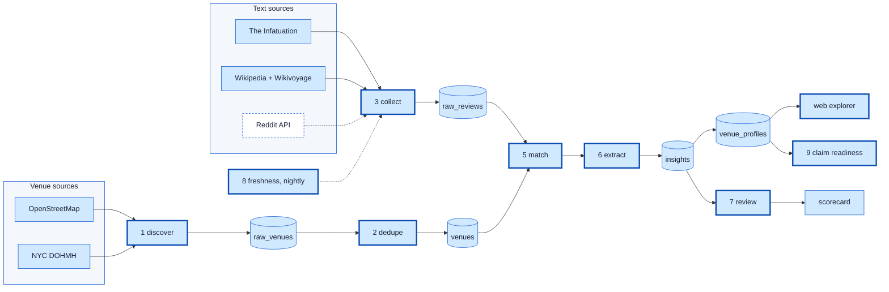

# Pipeline status

Live account of what has run and what the numbers are. Design is in [PLAN.md](PLAN.md); how things
work is in the [README](README.md). Updated as stages land.

_Last updated: 2026-09-03 12:50. Collection complete; batch 2 extraction running (~14 h left)._

Heavy border = built and verified. Dashed = coded but blocked (Reddit needs credentials).

## Numbers

| Stage | Status | Result |
|---|---|---|
| 1 discover | done | 7,130 OSM + 12,500 DOHMH records in 79 s; rerun skips all units in 2 s |
| 2 dedupe | done | 19,630 raw → 14,495 venues; 4,900 cross-source matches (79 % exact name, 73 % full address, 43 % phone); 437 DOHMH re-registrations + 43 OSM double-mappings merged; 1,487 pairs held for review |
| 3 collect | done | Wikipedia 440, Wikivoyage 226, Infatuation 8,119 of 8,146 sitemap entries (2 dead links, 12 unparsable), ~51 pages/min |
| 5 match | done, reruns | 8,785 rows: 3,291 matched, 521 review, 1,507 unmatched (mostly defunct Wikipedia venues), 3,466 outside Manhattan |
| 6 extract | running | Batch 2: 1,284 insights (1,185 on v3) of 3,291 matched reviews; 89 % of v3 rows with all evidence verbatim; ~24 s per review while the Mac is awake |
| 7 review | done | Two passes of 20. v2: 4 correct · 15 partial · 1 wrong (vibe inferred from awards/press). v3: 6 · 12 · 2 (under-extracts best time and events; neutral text read as negative). Evidence verbatim 60 % → 89 % |
| 8 freshness | scheduled | Scheduler container runs it daily at 03:00 (Asia/Manila); TTLs DOHMH 7 d, wiki 14 d, OSM/Infatuation 30 d |
| 9 claim readiness | done | 14,495 venues scored |
| web | done | Explorer, review page, status page; CI green |

## Running now

An unattended chain waits for the Infatuation pull, relinks, extracts every matched review with
prompt v3 (roughly 15–18 h), then rescores claims. The scheduler takes over from tomorrow.

## Next

1. Prompt v4 from the v3 findings: push for best_time and recurring_events when the text has lines, hours or 'show up early'; add a neutral sentiment for factual text; good_for must be an occasion or company, never an audience or a service remark. Run it side by side with v3 on the same reviews.
2. Human spot-check of the two review passes on the web review page.
3. Refresh the collect / match / extraction reports with final numbers when batch 2 ends.
3. Unmatched Infatuation venues inside Manhattan as a third venue feed.
4. Reddit, if credentials are ever added.

## Change log

- 2026-09-02 00:30–01:00 scaffold, discover, memory kit
- 01:00–03:45 dedupe, text sources (Reddit blocked → Infatuation/Wikipedia/Wikivoyage), match, extract (prompt v1→v3), review loop, freshness, claim readiness, README
- 2026-09-03 12:30–12:50 pull finished, batch 2 running, stage explanations on the status page, file logging, second review pass (v3)
- 04:00–05:15 web explorer, review page, status page, scheduler daemon, CI, history rewritten to Conventional Commits
