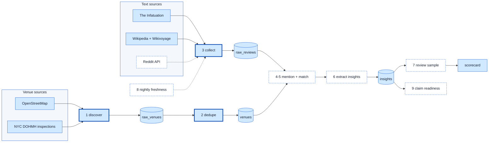

# Venue Insight Pipeline — living status report

Multi-source venue discovery, deduplication and LLM insight extraction for Manhattan, built as a
portfolio answer to the Moodap data-engineer brief. This file is the running account of what exists,
what the numbers are, and what is next. Design decisions live in [PLAN.md](PLAN.md); this file tracks
execution. Updated as stages land.

_Last updated: 2026-09-02 night shift. Commit `9e29e54`._

## Pipeline at a glance

Solid boxes with a heavy border are built and verified. Dashed boxes are designed but not built.
Cylinders are Postgres tables in the local Supabase stack. The Reddit path is coded but blocked on API
credentials, so it is dashed.

## Stage status

| # | Stage | What it does | Status | Key numbers |
|---|---|---|---|---|
| 1 | discover | Pull venue candidates from OSM (Overpass, bbox + borough polygon clip) and DOHMH (Socrata) into append-only `raw_venues`. Each amenity type / page is a resumable unit. | Done | 7,130 OSM + 12,500 DOHMH in 79 s; rerun skips all units in 2 s |
| 2 | dedupe | Normalise names/streets/phones, block by geohash (150 m) or zip+street, score name + address + distance + phone, merge same-source re-registrations, greedy one-to-one cross-source matching with a near-certain override. Every scored pair kept in `match_candidates`. | Done | 19,630 raw → 14,504 venues; 4,892 cross-source pairs matched; 436 DOHMH re-registrations + 43 OSM double-mappings merged; 1,486 pairs held for review. 10 unit tests |
| 3 | collect_reviews | Venue-centric prose from open web sources into `raw_reviews`: Infatuation review pages (sitemap → server-rendered JSON), Wikipedia category members (full extracts + coords), Wikivoyage eat/drink listings on 19 district pages. | Running | Infatuation 974 / 8,142 pages (background pull); Wikipedia 235; Wikivoyage ~200 (rerun in progress) |
| 3 | collect_text (Reddit) | Subreddit keyword search + comment trees via the official OAuth API. | Blocked | Reddit refuses anonymous JSON from this IP; needs script-app credentials or gets dropped |
| 4-5 | mention + match | LLM pulls venue mentions from free text; deterministic matcher links them (and the review sources' own venue records) to `venues`. | Next | — |
| 6 | extract_insights | Structured output per matched text: vibe tags, noise/crowd, best time, recurring events, sentiment, verbatim evidence quote, confidence. Provider interface: Ollama Qwen 2.5 7B locally, Anthropic API by env var. | Designed | Ollama structured output verified end to end (21 s first call) |
| 7 | review_sample | Writes a markdown sample of extractions per run; reviewer verdicts ingested by CLI into `extraction_reviews`; README scorecard computed from them. Loop: Qwen extracts → Claude reviews → human spot-checks. | Designed | — |
| 8 | freshness | Nightly compose service re-pulls text and re-extracts stale venues. Needs a TTL / `--force` because `stage_progress` marks units done permanently. | Designed | Scheduler container exists; job body pending |
| 9 | claim_readiness | Per-venue score from insight confidence, mention count and contact details, as a claim-conversion priority signal. | Designed | — |

## Sources and why these

| Source | Role | Access | Notes |
|---|---|---|---|
| OpenStreetMap (Overpass) | venues | public API, no key | Needs a real User-Agent (406 otherwise); area lookups for Manhattan return nothing, so bbox + polygon clip |
| NYC DOHMH inspections (Socrata `43nn-pn8j`) | venues | public API, no key | 313 rows without coordinates, 1,659 never inspected, uppercase legal names, `/`-joined multi-concept names |
| The Infatuation | text | public pages, robots allows generic crawlers | Editorial reviews with address, coords, price, neighbourhood, cuisine, "perfect for" tags. Covers all five boroughs; Manhattan filter applied at match time |
| Wikipedia | text | MediaWiki API, no key | Notable venues only; full extracts are one page per request |
| Wikivoyage | text | MediaWiki API, no key | `{{eat}}`/`{{drink}}`/`{{listing}}` templates with address, coords, hours, price, description |
| Reddit | text | official OAuth API | Anonymous JSON blocked from this IP on every host/UA tried |
| Rejected | — | — | Facebook, X: login walls + ToS. Foursquare: login redirect. Bluesky public API: 403 here. Google/Yelp/TripAdvisor: Moodap's named competitors, anti-scraping terms |

## Runtime

- Python 3.12 package `pipeline/` with a Typer CLI (`pipeline discover | dedupe | collect-reviews | collect-text | freshness | status`).
- Supabase local stack in Docker (Postgres 17); migrations in `supabase/migrations/`, applied with `supabase migration up`.
- Ollama on the Mac host (`qwen2.5:7b-instruct`); containers reach it and Postgres via `host.docker.internal`.
- `docker compose run --rm pipeline <stage>`; `scheduler` service loops for the nightly job.
- All external calls go through one polite client: per-host throttle, retry with jittered backoff, honours 429 `Retry-After`.
- Every stage records a `pipeline_runs` row and per-unit `stage_progress` markers, so any stage resumes after a crash.

## Rules the code follows

1. `raw_*` tables are never mutated by downstream stages; everything derived can be rebuilt from raw.
2. Every stage is idempotent and resumable.
3. Derived venue ids are stable across rebuilds (`venues.key` = primary source id).
4. Every match decision is persisted with its component scores for audit.
5. Schema changes are new migration files, never edits.

## Open decisions

- Keep or drop the Reddit path (needs a free script app from the user).
- When to create the public GitHub remote.
- Freshness TTL policy per source (editorial pages change rarely; social text often).

## Change log

- 2026-09-02: scaffold, discover, dedupe, review collectors, LLM provider interface, this document.
