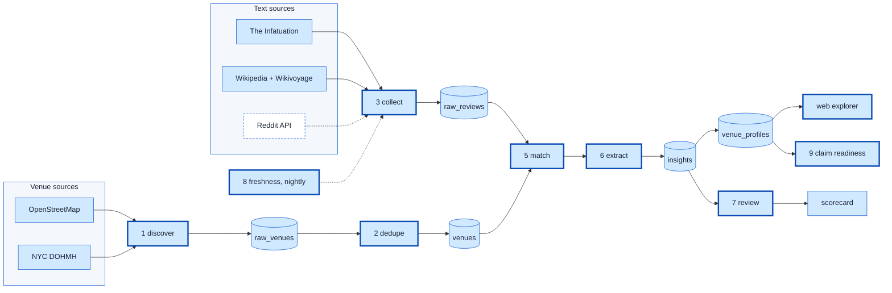

# Pipeline status

Live account of what has run and what the numbers are. Design is in [PLAN.md](PLAN.md); how things
work is in the [README](README.md). Updated as stages land.

_Last updated: 2026-09-02 night shift, 05:15. Pipeline and web app complete; background jobs still
filling tables._

Heavy border = built and verified. Dashed = coded but blocked (Reddit needs credentials).

## Numbers

| Stage | Status | Result |
|---|---|---|
| 1 discover | done | 7,130 OSM + 12,500 DOHMH records in 79 s; rerun skips all units in 2 s |
| 2 dedupe | done | 19,630 raw → 14,495 venues; 4,900 cross-source matches (79 % exact name, 73 % full address, 43 % phone); 437 DOHMH re-registrations + 43 OSM double-mappings merged; 1,487 pairs held for review |
| 3 collect | running | Wikipedia 440, Wikivoyage 226, Infatuation 6,394 of 8,142 pages (~51/min) |
| 5 match | done, reruns | 1,669 reviews matched, 269 review, 807 unmatched (mostly defunct Wikipedia venues), 1,676 outside Manhattan |
| 6 extract | running | 261 insights (162 on prompt v3); 80 % with all evidence verbatim; ~26 s per review |
| 7 review | done | First pass, 20 insights: 4 correct · 15 partial · 1 wrong. Main fault was vibe inferred from awards and press; prompt v3 addresses it |
| 8 freshness | scheduled | Scheduler container runs it daily at 03:00 (Asia/Manila); TTLs DOHMH 7 d, wiki 14 d, OSM/Infatuation 30 d |
| 9 claim readiness | done | 14,495 venues scored |
| web | done | Explorer, review page, status page; CI green |

## Running now

An unattended chain waits for the Infatuation pull, relinks, extracts every matched review with
prompt v3 (roughly 15–18 h), then rescores claims. The scheduler takes over from tomorrow.

## Next

1. Second review pass on prompt v3 output with a human spot-check; refresh the scorecard.
2. Refresh the collect / match / extraction reports with final numbers.
3. Unmatched Infatuation venues inside Manhattan as a third venue feed.
4. Reddit, if credentials are ever added.

## Change log

- 2026-09-02 00:30–01:00 scaffold, discover, memory kit
- 01:00–03:45 dedupe, text sources (Reddit blocked → Infatuation/Wikipedia/Wikivoyage), match, extract (prompt v1→v3), review loop, freshness, claim readiness, README
- 04:00–05:15 web explorer, review page, status page, scheduler daemon, CI, history rewritten to Conventional Commits
